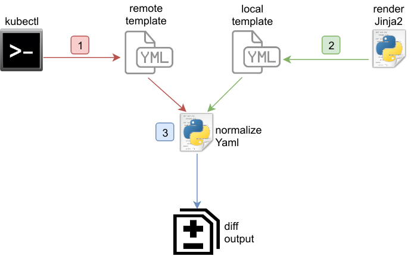

# Ansible role: K8s

This role renders an arbitrary number of [Jinja2](http://jinja.pocoo.org/) templates and deploys
or removes them to/from Kubernetes cluster.

Additionally this role offers a *dry-run*<sup><a href="#dry-run">[1]</a></sup> for Kubernetes deployments by doing a line-by-line
diff between local templates to deploy and already deployed templayes.

[](https://travis-ci.org/cytopia/ansible-role-k8s)
[](https://github.com/cytopia/ansible-role-k8s/tags)

**Table of Contents**

1. [Requirements](#requirements)
2. [Role variables](#role-variables)
3. [Dry-run](#dry-run)
4. [Examples](#examples)
5. [Testing](#testing)
6. [License](#license)


## Requirements

* Ansible 2.5
* [openshift](https://pypi.org/project/openshift/) Python package
* [PyYAML](https://pyyaml.org/) Python package
* [kubectl](https://kubernetes.io/docs/tasks/tools/install-kubectl/#install-kubectl)


## Role variables

Additional variables that can be used (either as `host_vars`/`group_vars` or via command line args):

#### Control variables

| Variable      | Description                  |
|---------------|------------------------------|
| `k8s_create`  | If set with any value, only deployments to create are executed. |
| `k8s_remove`  | If set with any value, only deployments to remove are executed. |
| `k8s_tag`     | Only deployments (create or remove) which have this tag specified in their definition are executed. |
| `k8s_force`   | Force deployment. The existing object will be replaced. |

#### Authentication variables

Each of the following values can also be set per item and will then take precedence over the
below listed global values:

| Variable          | Description                  |
|-------------------|------------------------------|
| `k8s_context`     | Global cluster context |
| `k8s_host`        | The kubernetes API hostname  |
| `k8s_api_key`     | API key/token to authenticate against the cluster |
| `k8s_ssl_ca_cert` | Certificate authority to authenticate against the cluster |
| `k8s_cert_file`   | Client certificate to authenticate against the cluster |
| `k8s_key_file`    | Client key to authenticate against the cluster |
| `k8s_username`    | Username to authenticate against the cluster |
| `k8s_password`    | Password to authenticate against the cluster |

#### List of templates to create/delete

The only required item key is `template`, everything else is optional.

```yml
# Specify a list of templates to remove
# Runs before k8s_templates_create
# Has the same arguments as k8s_templates_create
k8s_templates_remove: []

# Specify a list of templates to deploy
k8s_templates_create:
  - template:       # <str> Path to jinja2 template to deploy
    tag:            # <str> tag this template (used by k8s_tag to only deploy this list item)
    tags:           # <list> list of tags (mutually exclusive with tag)  
      - tag1
      - tag2
    context:        # <str> Overwrites k8s_context for this item
    host:           # <str> Overwrites k8s_host for this item
    api_key:        # <str> Overwrites k8s_api_key for this item
    ssl_ca_cert:    # <str> Overwrites k8s_ssl_ca_cert for this item
    cert_file:      # <str> Overwrites k8s_cert_file for this item
    key_file:       # <str> Overwrites k8s_key_file for this item
    username:       # <str> Overwrites k8s_username for this item
    password:       # <str> Overwrites k8s_password for this item
```

## Dry-run

The dry-run does not test if the templates to be deployed will actually work, it simply just adds
a diff output similar to `git diff`. With this you will be able to see any changes your local
template will introduce compared to what is already deployed at the moment.

#### How does it work

At a very brief level the dry-run works as follows:



1. Read out currently deployed template from Kubernetes via `kubectl`
2. Renders the local jinja kubernetes template
3. Diff compare both templates in human readable yaml format and add the result to Ansible's diff output

#### Particularities

Kubernetes automatically adds a lot of default options to its deployed templates, if no value
has been specified for it in your template. This would make the diff output unusable as local and
deployed templates would always show differences.

To overcome this problem, the K8s role offers a dictionary definition for all Kubernetes *kinds*
that define keys to ignore on remote side.

This *ignore* part is still work in progress as I did not have the chance to compare all available
deployment kinds. The current ignore implementation can be seen in [vars/main.yml](vars/main.yml).

#### How does it look

For dry-run it is recommended to use the `--diff` option so that you can actually see the changes.

```bash
$ ansible-playbook playbook-k8s.yml -i inventories/dev/hosts --check --diff
```

```diff
TASK [k8s : [my-kubernetes-cluster.k8s.local] diff: namespace.yml.j2] *******************
--- before
+++ after
@@ -1,8 +1,6 @@
 apiVersion: v1
 kind: Namespace
 metadata:
-  annotations:
-    jenkins-x.io/created-by: Jenkins X
   labels:
     name: jenkinks
   name: jenkinks

changed: [kubernetes]

TASK [k8s : [my-kubernetes-cluster.k8s.local] diff: metrics-server-dpl.yml.j2] **********
--- before
+++ after
@@ -1,7 +1,6 @@
 apiVersion: extensions/v1beta1
 kind: Deployment
 metadata:
-  annotations: {}
   labels:
     k8s-app: metrics-server
   name: metrics-server
@@ -10,10 +9,6 @@
   selector:
     matchLabels:
       k8s-app: metrics-server
+  strategy:
+    rollingUpdate:
+      maxSurge: '1'
+      maxUnavailable: '1'
   template:
     metadata:
       labels:

changed: [kubernetes]
```

## Examples

For all examples below, we will use the following Ansible playbook:

**`playbook.yml`**
```yaml
---
- hosts: all
  roles:
    - k8s
  tags:
    - k8s
```


### 1. Usage of variables

**Required files:**

**`create-k8s-namespace.yml.j2`**
```yml
---
kind: Namespace
apiVersion: v1
metadata:
  name: {{ my_namespace }}
  labels:
    name: {{ my_namespace }}
```

**`group_vars/all.yml`**
```yaml
---
# Custom variables for usage in templates
my_namespace: frontend

# Role variables
k8s_templates_create:
  - template: path/to/create-k8s-namespace.yml.j2
```

**How to execute:**
```bash
# Deploy namespace
$ ansible-playbook playbook.yml

# Overwrite namespace name
$ ansible-playbook playbook.yml -e my_namespace=backend
```

### 2. Usage of tags per item

**Required files:**

**`group_vars/all.yml`**
```yaml
---
k8s_templates_create:
  - template: path/to/pod1.yml.j2
    tag: stage1
  - template: path/to/pod2.yml.j2
    tags:
      - pod
      - stage2

k8s_templates_remove:
  - template: path/to/ds1.yml.j2
    tag: stage1
  - template: path/to/ds2.yml.j2
    tags:
      - pod
      - stage2
```

**How to execute:**
```bash
# Remove and deploy all files
$ ansible-playbook playbook.yml

# Only deploy files
$ ansible-playbook playbook.yml -e k8s_create=1

# Only deploy files with tag stage1
$ ansible-playbook playbook.yml -e k8s_create=1 -e k8s_tag=stage1
```

### 3. Usage of context per item

**Required files:**

**`group_vars/all.yml`**
```yaml
---
# context is global for all deployment files
k8s_context: minikube

k8s_templates_create:
  - template: path/to/pod1.yml.j2
  - template: path/to/pod2.yml.j2
  # The next item uses a different context (takes precedence over global context)
  - template: path/to/pod3.yml.j2
    context: dev-cluster
```

**How to execute:**
```bash
# IMPORTANT:
# When a context is attached to an item (as with pod3.yml)
# it will take precedence over any globally specified context.
# So this example will deploy everything into the cluster specified by the global context,
# except pod3.yml, which will always go into dev-cluster

# Deploy everything into minikube (pod3.yml will however be deployed into dev-cluster)
$ ansible-playbook playbook.yml -e k8s_create=1

# Deploy everything into a different cluster (pod3.yml will however be deployed into dev-cluster)
$ ansible-playbook playbook.yml -e k8s_create=1 -e k8s_context=prod-cluster
```

## Testing

#### Requirements

* Docker
* [yamllint](https://github.com/adrienverge/yamllint)
* [openshift](https://pypi.org/project/openshift/) Python package
* [PyYAML](https://pyyaml.org/) Python package
* [kubectl](https://kubernetes.io/docs/tasks/tools/install-kubectl/#install-kubectl)


#### Run tests

```bash
# Lint the source files
make lint

# Run integration tests with default Ansible version
make test

# Run integration tests with custom Ansible version
make test ANSIBLE_VERSION=2.6
```


## License

**[MIT License](LICENSE)**

Copyright (c) 2018 [cytopia](https://github.com/cytopia)
